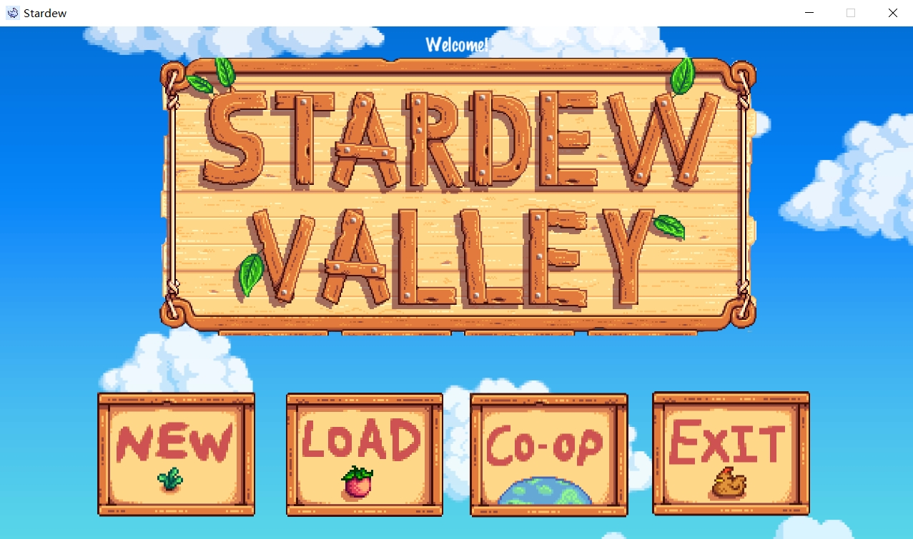
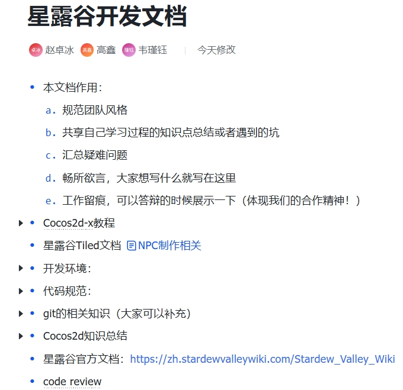

# 项目概述

**项目名称**: 星露谷物语类游戏

**引擎**: Cocos2d-x

**开发语言**: C++

**开发环境**：VS 2022; Cocos2d-x-3.17.2

**平台**: PC (Windows)

**游戏类型**: 模拟经营，角色扮演（RPG）

**项目描述**:  本项目是一个基于《星露谷物语》玩法的模拟经营类游戏，玩家通过种植农作物、养殖动物、与村民互动等日常活动来逐步建设并经营自己的农场。游戏的核心玩法包括农业、养殖、钓鱼、社交、探险、技能升级等。




# 游戏核心功能

## 游戏场景

- **场景**: 游戏的世界包括多个区域，如农场、海滩、洞穴等。玩家可以自由在这些场景中移动，并与其他 NPC 互动。

## 玩家角色

- **玩家角色控制**: 玩家控制主角进行日常操作，如走动、采集、与 NPC 互动等。通过键盘、鼠标操作。

- **属性系统**: 玩家的属性包括在社区中的声望、不同技能点构成的技能树。

- **技能树**：玩家的角色技能树包裹农业、采矿、钓鱼、料理四个技能，按键盘E键打开。相应操作每完成一定次数后技能等级增加；同时等级越高相应操作时间越短或获取概率越高。

## 农场管理

- **耕种与收获**: 玩家可以选择种植不同种类的作物，管理土地，浇水并等待作物成熟。
- **干旱威胁**：当一段时间不对作物处理时作物会死亡，此时需要移除作物才能进行下一轮种植。
- **动物养殖**: 玩家可以饲养动物，如鸡、牛、羊等，并收集动物产品如鸡蛋、牛奶等。
- **钓鱼** : 本游戏设计了丰富的钓鱼场景
- **农场资源管理**：农场水资源有限且需定期进行补充，实现了水资源的管理。同时对种植的种子和肥料进行存储管理。

## 物品管理

- 玩家可以通过种植、挖掘、钓鱼、采集等方式获得各种物品，物品包括种子、工具、资源等。

## 社交系统

- **NPC 互动**: 游戏中有多个村民，玩家可以通过赠送礼物、聊天等方式与他们建立不同的关系，包括初始的陌生、友谊、浪漫关系。
- **任务系统**: 游戏内相应的npc有相应的任务，玩家可以接受这些任务，获取奖励并推动剧情发展，任务包括提交收集物品和修复建筑，任务完成后将提高玩家声望值并给出奖励。

## 时间系统

- 游戏内有日期和季节变化，农场内物品会随时间变化而发生不同的事件，玩家可以在特殊的时间内完成任务，包括节日庆典和社区活动。

## 天气系统

- 游戏场景中实现了每日不同的天气，包括晴、雨、雪等，不同的天气会对农场的作物等产生相应的影响。在雨天时移动速度慢，晴天时移动速度快。

## 市场系统

- 玩家的可以通过出售农产品来获取金钱，不同时期不同农产品的价格会动态调整。

## 存档功能

- 玩家可以在退出游戏后点击load加载之前的存档，这是游戏可玩性必不可少的一部分。

# 技术架构

## 游戏引擎

- **Cocos2d-x**: 使用 Cocos2d-x 引擎进行游戏开发，提供了灵活的场景管理、物理引擎和动画支持。
- **UI框架**: 使用 Cocos2d-x 内置的 UI 元素，如按钮、文本框、图片等，搭建游戏的用户界面。

## 面向对象编程

- **封装**：
  -  所有的组件都封装在类中， 在不同的场景中调用封装好的组件。
  - 公有接口，私有实现：数据和操作这些数据的函数组合在一起，并限制外部直接访问数据。
  - 保护数据安全，同时隐藏实现细节，使代码更加模块化。
- **继承和多态**: 
  - 不同的类之间有继承关系
  - 代码复用，通过继承基类共享通用功能
  - 灵活扩展功能，避免重复代码
  - 解耦模块间的依赖


## 代码风格统一规范

在本项目的开发过程中，我们严格遵守了既定的编码规范与命名约定，使得代码在可读性、可维护性以及可扩展性方面都保持较高水准。以下是项目中对**代码风格**所作的统一要求：

1. **命名规范**

   - **类名（Class）**：采用首字母大写的方式，后续单词也首字母大写（如 `FarmMap`, `Player`, `ItemFactory`）。
   - **函数名（Method/Function）**：采用小驼峰式命名（CamelCase），首字母小写，后续单词首字母大写（如 `getInstance()`, `moveMapByDirection()`）。
   - **成员变量（Member Variables）**：采用小驼峰的方式命名（如 `itemName`, `playerMoney`）。
   - **全局或文件内常量（Constants）**：全部字母大写并使用下划线分割（如 `PLAYER_INITIAL_MONEY`, `WINSIZE`）。
   - **命名含义清晰**：变量、函数、类名力求简洁且自解释，不使用无意义缩写；在名称中体现功能或含义，如 `isCollidable`, `mapUpdateByTime()` 等。

2. **文件组织和注释**

   - 文件头注释：每个`.h`或`.cpp` 文件顶部都有简要注释，说明该文件的功能与作者信息，类似如下格式：

     ```cpp
     /****************************************************************
      * File Function: 实现XXXX功能
      * Author:        XXX
      ****************************************************************/
     ```

   - **类/函数注释**：对于类或函数的关键逻辑，会在声明或定义处使用简要注释描述其作用、参数、返回值或特殊注意事项。

   - **实现与声明分离**：头文件(`.h`)只做类的声明、接口的定义、常量的声明；源文件(`.cpp`)中完成具体实现，并在必要时添加实现细节注释。

   - **抽象基类和接口类**：在类定义前加注释标明这是一个抽象基类（如 `Item`）或接口类，提醒其他开发者该类不能直接实例化，需要派生后使用。

3. **排版与格式**

   - **缩进和空格**：统一使用四个空格进行缩进；运算符两侧保持适度空格（如 `x = y + z`）；函数参数列表中的逗号后也应有空格。

   - 花括号（大括号）风格：采用 K&R 风格，即在函数或控制语句后紧随 `{`，例如：

     ```cpp
   if (condition) {
         // ...
   } else {
         // ...
     }
     ```

   - **每行只做一件事**：避免同一行出现多种操作，保证代码逻辑可追踪、易读。如需要多步操作时，分多行进行。

   - **空行与分段**：逻辑相关但独立的代码块间使用空行隔开，增强可读性；不在文件末尾留多余空行。
   
4. **一致的代码结构**

   - **头文件顺序**：在各个 `.cpp` 文件中包含头文件时，先包含与自身类对应的头文件，然后是Cocos2d-x系统头文件或其他模块头文件，再往后是项目内部其他模块的头文件。
   - **单例类**：如 `FarmMap`, `Player` 等单例使用静态指针 `instance` 与 `getInstance()`，并在 `.cpp` 中定义静态成员，避免多处重复。
   - **资源管理**：使用清晰的资源路径（如 `ResPath::STAND_DOWN`）或统一的宏常量（如 `SOIL_GID`）来管理图片、音频等资源，避免硬编码。

5. **示例：`Item` 和 `ItemFactory` 中的风格实践**

   - `Item.h` 中采用抽象基类的方式，声明了纯虚函数 `init()` 和 `useItem()`，并在头文件顶部添加文件功能注释、作者信息。
   - `ItemFactory.h` 中使用工厂模式创建不同的物品，函数 `createItem()` 返回多态基类 `Item*`，并根据字符串识别特定的具体类；函数体内使用大量 `if-else` 分支，且使用 `CCLOG` 提示未知物品名。
   - 命名上，如 `axe`, `pickaxe`, `kettle` 等参数名称直观地反映了物品功能；相关类命名如 `Axe`, `Pickaxe`、`Kettle` 也与物品类型一一对应，增强可读性。

6. **可读性与可维护性**

   - **减少神秘数字**：常量或枚举统一放在 `Constant.h` 或相关宏定义中，禁止出现魔法数字（Magic Number）。
   - **拆分函数**：对于过长或逻辑复杂的函数，将功能相对独立的部分提取为子函数，降低单个函数的复杂度；如在 `FarmMap` 中对不同地形交互拆分为 `interactWithSoil()`, `interactWithGrass()`, `interactWithStone()` 等。
   - **简洁清晰的逻辑**：在流程较长的函数中，以注释或空行分隔不同逻辑阶段，帮助读者快速理解功能走向。

通过以上约定和实践，本项目在开发过程中始终保持了**一致、清晰、可读**的代码风格，为团队协作和后续维护提供了良好的基础。若在后续迭代中有新的风格要求或最佳实践出现，也将及时更新到本规范中。

## 使用git合作开发

在本项目中，我们采用 **Git** 进行版本控制与协同开发，以确保团队间代码合并和变更管理的高效、可靠。主要流程如下：

1. **代码托管**：所有代码托管于远程仓库（如 GitHub），方便团队成员随时 clone、pull、push 更新代码。
2. **分支管理**：
   - **主分支（master ）**：始终保持可发布的稳定版本。
   - **开发分支（feature）**：针对新功能或修复BUG，创建独立的功能分支进行迭代；开发完成后合并至主分支。
3. **提交规范**：
   - 提交信息（commit message）应简洁明了，描述本次提交的主要改动，如“修复碰撞检测逻辑”或“添加道具系统”。
   - 同一功能或模块改动集中在一个提交，避免多个无关改动混合提交。
4. **合并策略**：
   - 采用 Pull Request的方式提交合并请求，由组长评审通过后再合并，以保证代码质量。
   - 合并前确保在本地完成自测和冲突解决。

通过以上流程，本项目有效地降低了合并冲突的风险，并保证了多人协作开发的效率和代码质量。

## 使用飞书进行问题汇总与知识整理

我们使用飞书的共享文档来进行问题汇总以及知识分享和整理，小组成员互相学习。




# 类的架构

## Player（单例）

    键盘上下左右控制移动，鼠标左键使用工具。

## Bag（单例）

    鼠标滚轮选择背包中的物品，按键1-9也可以直接选择背包第一排的物品。
    
    选中的物品非工具时可以使用键盘Q键移除。
    
    有新的物品获取时，若背包非空则顺序加到背包中，相同的物品按数量不重复显示。

## Control（单例）

    对游戏中所有键盘和鼠标监视器进行初始化和控制。
    
    包括玩家移动、物品丢弃、烹饪、键盘选择物品的键盘监视器，和鼠标滚轮选择物品、右键条件打开对话框的鼠标监视器。

## Event

CommunityEvent

    社区特殊事件

Festival

    特殊节日庆典，继承了CommunityEvent类。

## Manager

DateManage

    进行游戏时间的管控，一定时间增加游戏日期。

WeatherManager

    进行游戏天气的管控，包括晴天、雨天、雪天。对作物和动物生长产生影响。晴天时Animal的移动速度较快，其他时较慢。

## DialogueBox

    用于打开玩家与npc的对话框和noticeBoard的对话框。Player在可打开对话框对象附近一定距离内使用鼠标右键则打开对话框，此后根据内容不同使用鼠标左键推进/选择、使用键盘Q键赠送npc礼物等。

## Item

 - Tool

   - Axe 斧子
   - Fertilizer 化肥
   - Hoe 锄头
   - Kettle 水壶
   - MilkingPail  
   - FishingRod 鱼竿
     - 在玩家初次进入海滩场景时获得。
   - Pickaxe 十字镐
     - 在玩家初次进入洞穴场景时获得
   - Scythe 镰刀
   - Seed 种子
     - 其中Seed类有appleSeed, cornSeed等具体实现

 - Food

   - Fish

     tuna, pufferFish, anchovy

   - CarrotFood

   - CornFood

   - DogbaneFood

 - ItemFactory

   物品工厂，负责造工具

 - CampFire

   在玩家初次使用鱼竿钓到第一条鱼后解锁。玩家在选择背包中Food类Item的时候靠近篝火，使用键盘C键可以进行烹饪当前食物。

 - StoneItem

## Map

 - BeachMap

   从农场场景向下即可走到

 - SceneMap

## Skill

 - Skill

   包括技能名称、最大等级、当前等级及不同效果

 - SkillTree

   集成了农业、钓鱼、烹饪、采矿的技能树，最高等级均为五级。

   农业：每种植五次植物升级，级别越高，采摘植物时获得第二份的概率越大。

   钓鱼：每钓到五次鱼类升级，级别越高钓鱼成功率越高。

   烹饪：每完成五次烹饪升级，级别越高一次烹饪所需时间越短。

   采矿：每挖下五块石头升级，级别越高，挖取时获得第二份石头的概率越大。

 - SkillTreeUI

   用于展示技能树的点数。使用键盘E键展开关闭。随玩家行动自动升级。

## Npc

    靠近后右键进行对话和其他选项（赠送礼物、接受任务、查看关系）

 - Wizaed Yuuu
   特殊任务：提交一只金枪鱼，之后获得随机数量的石头

 - Cleaner Levi
   特殊任务：在海滩地图找到告示牌，完成建筑修建，之后获得随机数量的金枪鱼

 - noticeBoard
   同样靠近后右键对话，若背包中含有三个及以上石头可以选择提交，提交后修建成功建筑，告示牌消失。

## Animal

 - Animal
 - AnimalManager
 - Chicken
 - Cow
 - Pig
 - Sheep

 ### Plant

  - Crop
  - CarrotCrop
  - CornCrop
  - DogbaneCrop

# 开发流程

## 初期阶段

- **需求分析**: 了解游戏核心玩法，设计游戏角色、场景、工具等。
- **原型设计**: 根据需求设计游戏的核心原型，特别是玩家控制、场景切换、物品管理等功能。
- **项目结构搭建**: 使用 Cocos2d-x 初始化项目，搭建文件结构，准备好游戏的基础模块。

## 迭代阶段

- **场景与地图制作**: 设计和制作农场等游戏场景。
- **玩家行为系统**: 实现玩家角色的行为，包括走动、与物品互动、与 NPC 对话等。
- **任务与事件系统**: 设计并实现任务机制，设计事件触发机制。
- **农场管理系统**: 实现作物生长、养殖动物等玩法。

## 后期阶段

- **测试与调优**: 进行功能测试，修复游戏中的 bug，调优游戏的平衡性。


# 开发中遇到的问题及解决方法


